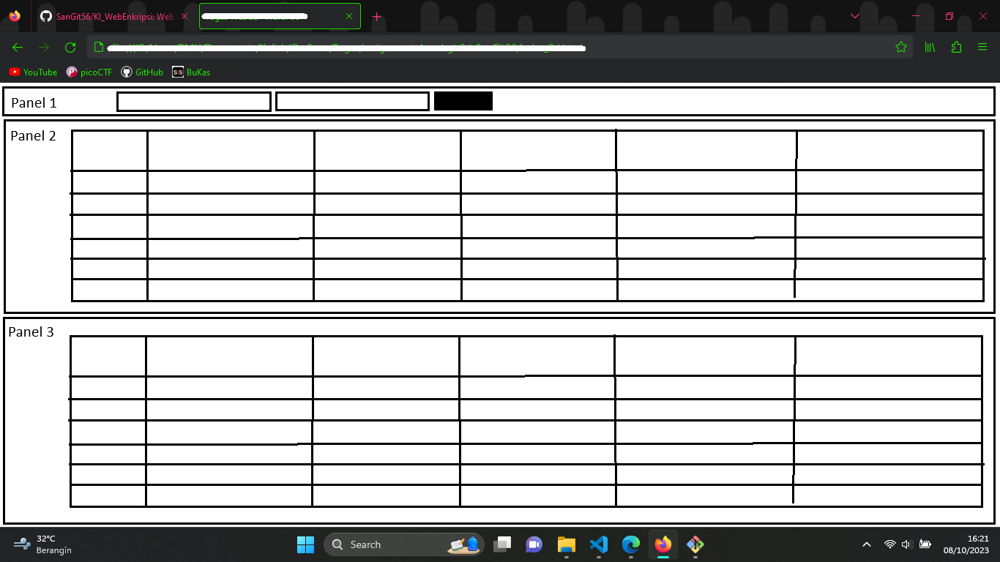

# KI_WebEnkripsi
Web enkripsi sebagai tugas mata kuliah Keamanan Informasi

## Kebutuhan
~~1. Skema basis data~~ 
2. _Frontend_ 
    Dibagi menjadi panel-panel: 
     
    a. Panel 1 berisi formulir isian _username_ dan _password_ 
    b. Panel 2 berisi data mentah dari tabel pada _database_ (data terenkripsi) 
    c. Panel 3 berisi data yang telah diterjemahkan 
3. _Backend_ 
    a. Validasi _form_ cukup pakai HTML 
    b. Jumlah pengguna tetap (tidak ada fitur CRUD untuk pengguna), telah tersedia di sistem, dan akan ditulis informasi untuk _login_-nya di situs 
    c. Sistem hanya untuk mengunggah data, menyimpannya menggunakan 3 metode enkripsi berbeda, dan mengambil kembali data untuk dibaca atau diunduh

## Basis Data
Terdiri atas 4 tabel: 
1. **ki_pengguna** untuk menyimpan akun pengguna 
2. **ki_aes** untuk menyimpan data yang dienkripsi menggunakan AES 
3. **ki_rc4** untuk menyimpan data yang dienkripsi menggunakan RC4 
4. **ki_des** untuk menyimpan data yang dienkripsi menggunakan DES 

Tabel untuk menyimpan data memiliki kolom rujukan ke tabel pengguna, data pribadi (merujuk pada UU PDP), dokumen-dokumen, serta untuk IV (_initialization vector_) dan _key_