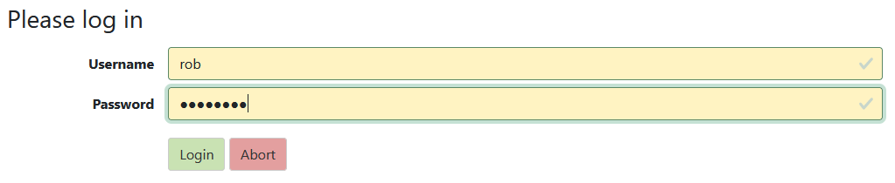

# List of Contents
- [OpenXPKI Install](#openxpki-install)
  - [Applications you need to have before following this tutorial](#applications-you-need-to-have-before-following-this-tutorial)
  - [Steps](#steps)

- [OpenXPKI Tutorial](#openxpki-tutorial)
  - [As Common Users](#as-common-users)
    - [Certification Request](#certification-request)
    - [Download Private Key](#download-private-key)
    - [Certificate Revocation](#certificate-revocation)
  - [As RA (Registration Authority)](#as-ra-registration-authority)
    - [Certification Request Approval](#certification-request-approval)
    - [Certificate Revocation Approval](#certificate-revocation-approval)
  - [As CA (Certificate Authority)](#as-ca-certificate-authority)

# OpenXPKI Install
There are 2 methods to run OpenXPKI yourself (yes, you can try OpenXPKI in the [demo site](http://demo.openxpki.org/)): First, by getting a Debian box ready and download the packages from the [package mirror](http://packages.openxpki.org/), see [https://github.com/openxpki/openxpki](https://github.com/openxpki/openxpki). Second, by using a ready-to-use docker image _whiterabbitsecurity/openxpki3_. In this installation tutorial, we will cover the second method as there will be a complex step in the first method. Also this tutorial is for those who are trying from Windows.

## Applications you need to have before following this tutorial
1. WSL (Windows Subsystem Linux) with Ubuntu installed
2. Docker Desktop (optional)

## Steps
1. Open WSL, find the 'v' (arrow-down) symbol near '+' sign near the terminal tab title, click it
2. Choose "Ubuntu" from the dropdown<br />

3. (optional) Make a directory and enter it
```shell
mkdir <directory_name> // make directory
cd <directory_name> // enter directory
```
4. Clone the [openxpki-docker](https://github.com/openxpki/openxpki-docker) repository, a new folder is created, enter it. This repo is where the Dockerfile and docker-compose file exists
```shell
git clone https://github.com/openxpki/openxpki-docker.git
cd openxpki-docker
```
5. We need to place a configuration folder. In the current directory, clone the [openxpki-config](https://github.com/openxpki/openxpki-config) repository **community** branch
```shell
git clone https://github.com/openxpki/openxpki-config.git --single-branch --branch=community
```
6. Copy contrib/wait_on_init.yaml  to openxpki-config/config.d/system/ and name it local.yaml
```shell
cp contrib/wait_on_init.yaml  openxpki-config/config.d/system/local.yaml
```
7. Change the _whiterabbitsecurity/openxpki3_ image to 3.24 in **docker-compose.yml** under the **openxpki-server** and **openxpki-client** section. Open **docker-compose.yml** using **nano** by typing `nano docker-compose.yml`. Save it by typing `Ctrl + O`, click `Enter`,  and then type `Ctrl + X` to exit<br />

8. Inside the **openxpki-config** directory, checkout to branch v3.24. Go back to the parent directory
```shell
cd openxpki-config
git checkout v3.24
cd ..
```
9. Run docker-compose as daemon (in the background, so you still be able to input command)
```shell
docker-compose up -d
```
10. Wait until the containers are ready<br />

11. Access [https://localhost:8443/openxpki](https://localhost:8443/openxpki) in your web browser. The system is ready, but without any tokens installed (some user roles need this)<br />

12. To create ready-to-use tokens/certificates, use the _testdrive_
```shell
docker exec -it openxpki-docker-openxpki-server-1 /bin/bash /etc/openxpki/contrib/sampleconfig.sh
```
13. You can also monitor running containers in Docker Desktop<br />


# OpenXPKI Tutorial
## As Common Users
### Certification Request
1. Select **Test Accounts** for the Handler. We will login as the **users** role

2. Login as anyone as long as the role is **users**. In this example we will use **bob**

3. Navigate to **Request certificate** page. In this example, we will choose **TLS/Web Server** as the Certificate Profile

4. There are some options for the request type, in this tutorial we will generate the key manually. Adjust the parameters the same as the second picture


5. The view will change to **Edit Subject** page. Fill the inputs depending on your case

6. In the **Edit Certificate Info** page you can just **Continue**
7. Review request, if all are correct, click **Submit request**
8. Save the generated password as it will be used to download the private key certificate

9. Wait for the request approval by Registration Authority (RA)

### Download Private Key
10. Check request status in **Home > My Certificates**. Once it is approved, it will show "Issued" as its status


11. Download private key by clicking the **Download private key** link

12. Fill the password input with the password that had been generated before. Then click **Continue**. Key will be downloaded

### Certificate Revocation
13. To revoke certicate, navigate to **Revoke certificate**. Fill certificate identifier and choose the reason code. Click **Continue**

14. If you really want to revoke, click **Submit Request**

15. Wait for the revocation request approval by Registration Authority (RA)

## As RA (Registration Authority)
### Certification Request Approval
1. Select **Test Accounts** for the Handler. This time we will login as the **operators** role. In this example we will use **rob**

2. Navigate and click **Home**. A dropdown will appear, choose **My Tasks**. A read view about certification requests will load


3. Click the request and do some review. To approve, click **Approve Request**

### Certificate Revocation Approval
4. Navigate to **Home > My Tasks** a **Revocation Requests** table will appear. Click the request and do some review. To approve, click **Approve Revocation**


## As CA (Certificate Authority)
